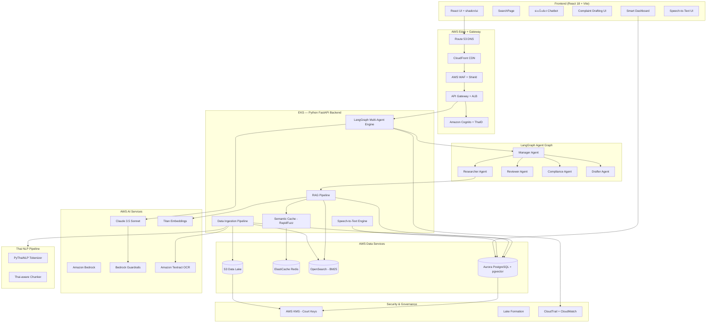
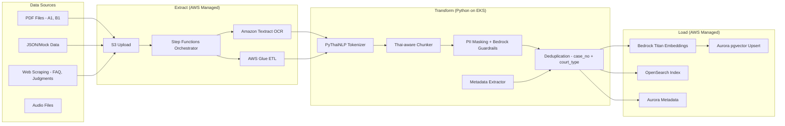
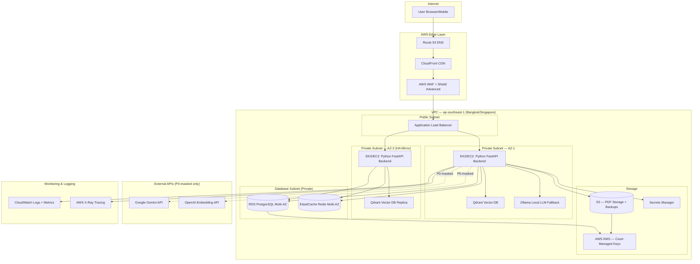
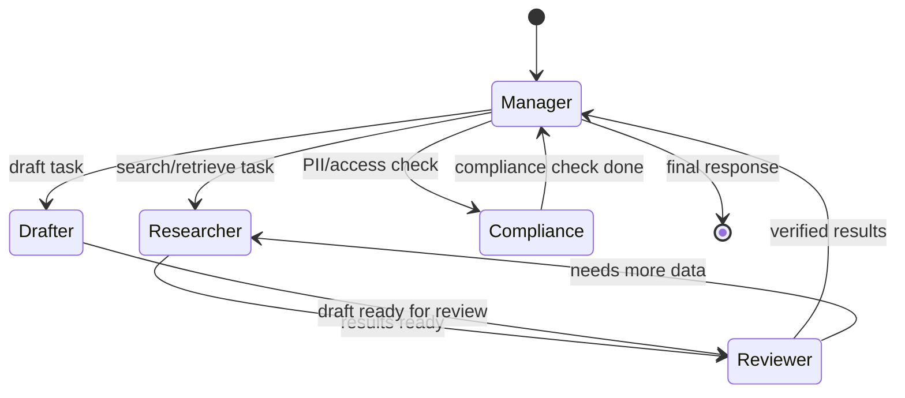
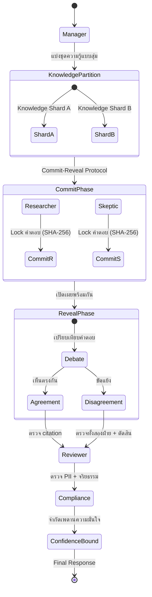
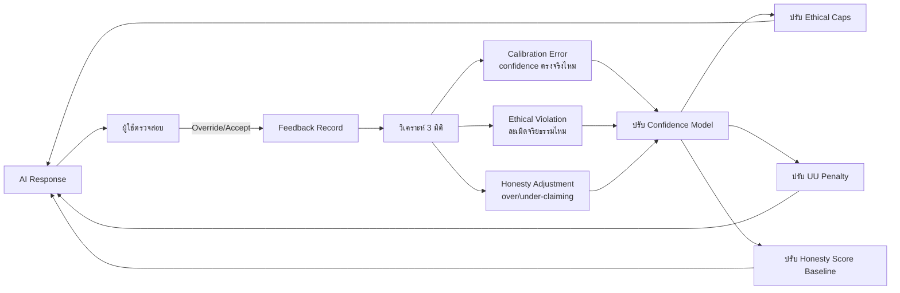

# Design Document: Smart Court AI Enhancement

## Overview

ระบบ Smart Court AI Enhancement ยกระดับ Smart LegalGuard AI จากระบบที่ใช้ LLM สร้างผลลัพธ์โดยตรง (hallucination-prone) ไปสู่ระบบ RAG-based ที่อ้างอิงข้อมูลจริงจากศาลยุติธรรม (Set A) และศาลปกครอง (Set B) โดยใช้ AWS Managed Services เป็นโครงสร้างพื้นฐานหลัก:

1. **Data Ingestion Pipeline** — S3 → Amazon Textract (OCR) → AWS Glue (ETL) → PyThaiNLP (chunking) → Bedrock Titan Embeddings → Aurora pgvector
2. **Hybrid Search RAG** — OpenSearch (BM25) + Aurora pgvector (semantic) → Cross-encoder reranking → Bedrock Claude 3.5 Sonnet generation with citations
3. **LangGraph Multi-Agent** — แทนที่ simulated orchestrator (`agentOrchestrator.ts`) ด้วย LangGraph ReAct agents จริง บน EKS
4. **Semantic Cache** — ElastiCache Redis + RapidFuzz ลด latency สำหรับ repeated/similar queries
5. **Anti-Hallucination** — 5 ชั้น: RAG grounding → Citation verification → Bedrock Guardrails → Unverified flagging → "ไม่รู้" policy
6. **New AI Features** — Complaint Drafting, Judgment Drafting, Case Outcome Prediction, Speech-to-Text, Smart Dashboard

### Current vs Target Architecture

| Component | Current | Target (AWS) |
|-----------|---------|--------------|
| LLM | Gemini via Lovable Gateway | **Amazon Bedrock** (Claude 3.5 Sonnet + Amazon Nova) |
| Embeddings | None | **Bedrock Titan Embeddings** (ข้อมูลไม่ออกนอก AWS) |
| Search | Gemini generates fake results | **Hybrid RAG**: OpenSearch (BM25) + Aurora pgvector (semantic) |
| Chatbot | Gemini direct (no context) | RAG-enhanced via Bedrock + Knowledge Base citations |
| Orchestrator | Simulated `agentOrchestrator.ts` | **LangGraph** on EKS (Reflection + ReAct agents) |
| Data | 25 mock cases + PDF forms | 160,000+ judgments + forms + regulations |
| Backend | Supabase Edge Functions (Deno) | **EKS** + Python FastAPI + **API Gateway** + ALB |
| Frontend | Lovable hosting | **Amplify** + **CloudFront** CDN |
| Database | Supabase PostgreSQL | **Aurora PostgreSQL Multi-AZ** + pgvector |
| Vector DB | None | **Aurora pgvector** (managed, ไม่ต้อง maintain Qdrant) |
| Cache | None | **ElastiCache Redis** Multi-AZ + RapidFuzz |
| OCR | EasyOCR (self-hosted) | **Amazon Textract** (managed, แม่นยำกว่า) |
| ETL | Custom Python pipeline | **AWS Glue** + **Step Functions** + **DataBrew** |
| Auth | Supabase Auth | **Amazon Cognito** + **ThaID** integration |
| Encryption | None | **AWS KMS** (ศาลถือ CMK) |
| PII Protection | `piiMasking.ts` (frontend) | `piiMasking.ts` + **Bedrock Guardrails** (double layer) |
| Audit | localStorage CAL-130 | PostgreSQL CAL-130 + **CloudTrail** + **CloudWatch** |
| Firewall | None | **AWS WAF** + **Shield Advanced** |
| Data Governance | None | **Lake Formation** + **DataZone** (PDPA compliance) |
| BI Dashboard | Mock charts | **QuickSight** + custom Smart Dashboard |
| Memory | localStorage `layeredMemory.ts` | PostgreSQL + LangGraph checkpointers (STM/LTM) |
| Fine-tuning | None | **SageMaker** + WangchanX-Legal (Phase 2) |

### Phased Approach

- **Phase 1**: Ingest available data (98 Justice Court PDFs, ~90 Admin Court PDFs, guides, FAQs, mock cases), build RAG pipeline, replace simulated search
- **Phase 2**: Ingest court judgments (160,000+) and AI training data when received, enable prediction and advanced drafting features

## Architecture

### High-Level System Architecture



### Data Ingestion Pipeline Architecture (AWS)



### RAG Search Pipeline (FAISS + BM25 + LeJEPA Reranking)

```mermaid
graph LR
    Query[User Query] --> PII_Mask[PII Masking + Bedrock Guardrails]
    PII_Mask --> CacheCheck{ElastiCache Hit?}
    CacheCheck -->|Hit| CacheResult[Return Cached Result]
    CacheCheck -->|Miss| Embed[Bedrock Titan Embedding]
    Embed --> HybridSearch[Hybrid Search]
    HybridSearch --> BM25[BM25 Keyword Search]
    HybridSearch --> FAISS[FAISS Vector Search]
    BM25 --> Merge[RRF Score Merge]
    FAISS --> Merge
    Merge --> LeJEPA[LeJEPA Reranking]
    LeJEPA --> OOD{OOD Detection}
    OOD -->|In-Distribution| TopK[Top-K Documents]
    OOD -->|Out-of-Distribution| LowConf[Flag Low Confidence]
    TopK --> LLM[Bedrock Claude 3.5 + Guardrails]
    LowConf --> LLM
    LLM --> CitationCheck[Citation Verification]
    CitationCheck --> CacheStore[Store in ElastiCache]
    CacheStore --> Response[Response with Citations + Confidence Badge]
```



**ทำไมใช้ FAISS + BM25 + LeJEPA:**

| Component | ทำไมเลือก | ข้อดี |
|-----------|----------|-------|
| **FAISS** | Vector search ที่เร็วที่สุด (Meta) | Sub-millisecond search, รองรับ 100M+ vectors, GPU acceleration |
| **BM25** | Keyword search สำหรับศัพท์กฎหมายเฉพาะ | จับคู่มาตรา/เลขคดีได้แม่นยำ เช่น "มาตรา 341" |
| **LeJEPA** (แทน Cross-encoder) | Reranking ที่เข้าใจบริบทกฎหมายไทย | มี OOD detection, energy function, SIG-Reg ป้องกัน dimensional collapse |

#### Query Rewriting (แปลงคำถามกำกวมให้ชัดเจน)

ก่อนส่งคำค้นหาเข้า Hybrid Search ระบบจะแปลงคำถามภาษาไทยที่กำกวมให้เป็นคำค้นหาที่เหมาะสม:

```python
QUERY_REWRITE_PROMPT = """คุณเป็นผู้เชี่ยวชาญด้านกฎหมายไทย
แปลงคำถามของผู้ใช้ให้เป็นคำค้นหาที่เหมาะสมสำหรับฐานข้อมูลกฎหมาย

กฎ:
1. ระบุประเภทคดี (แพ่ง/อาญา/ปกครอง) ถ้าเป็นไปได้
2. ระบุมาตรากฎหมายที่เกี่ยวข้อง ถ้าทราบ
3. แปลงภาษาพูดเป็นศัพท์กฎหมาย
4. ถ้าคำถามกำกวมเกินไป ให้สร้างคำค้นหาหลายแบบ

ตัวอย่าง:
- "ถูกโกงเงินต้องทำยังไง" → "ฟ้องคดีฉ้อโกง ป.อ. มาตรา 341 ขั้นตอนการยื่นฟ้อง"
- "แฟนเก่าเอารูปไปโพสต์" → "เผยแพร่ภาพส่วนตัวโดยไม่ยินยอม พ.ร.บ.คอมพิวเตอร์ มาตรา 14 PDPA"
- "นายจ้างไม่จ่าย OT" → "ค่าล่วงเวลา พ.ร.บ.คุ้มครองแรงงาน มาตรา 61 เลิกจ้างไม่เป็นธรรม"
- "ฟ้องหน่วยงานรัฐได้ไหม" → "คดีปกครอง พ.ร.บ.จัดตั้งศาลปกครอง มาตรา 9 เขตอำนาจศาล"
"""

async def rewrite_query(raw_query: str, role: str) -> dict:
    """แปลงคำถามผู้ใช้ให้เป็นคำค้นหาที่เหมาะสม"""
    # 1. ใช้ LLM แปลงคำถาม
    rewritten = await llm.generate(
        system=QUERY_REWRITE_PROMPT,
        user=f"บทบาทผู้ใช้: {role}\nคำถาม: {raw_query}",
    )

    # 2. สร้าง multi-query สำหรับ Hybrid Search
    return {
        "original": raw_query,
        "rewritten": rewritten,
        "keywords": extract_legal_keywords(rewritten),  # มาตรา, เลขคดี, ศัพท์กฎหมาย
        "case_type_hint": classify_case_type(rewritten),  # แพ่ง/อาญา/ปกครอง
    }
```

**ตำแหน่งใน Pipeline:**

```
User Query → PII Masking → Query Rewriting → Cache Check → Hybrid Search → LeJEPA Rerank → LLM
```

**LeJEPA Reranking Pipeline:**

```python
from app.services.lejepa_engine import LeJEPAEngine

def lejepa_rerank(query: str, candidates: list[dict], top_k: int = 10) -> list[dict]:
    """Rerank search results ด้วย LeJEPA similarity + OOD detection"""
    engine = LeJEPAEngine.get_instance()

    scored = []
    for doc in candidates:
        # 1. คำนวณ LeJEPA similarity (context-aware, ไม่ใช่แค่ cosine)
        result = engine.infer(
            context={"query": query, "statutes": doc.get("statutes", [])},
            target_hint=doc["chunk_text"],
        )

        # 2. ตรวจ OOD — ถ้าข้อมูลอยู่นอก distribution → ลด confidence
        is_ood = engine.is_out_of_distribution(result)
        energy_ok = engine.is_energy_compatible(result)

        # 3. คำนวณ final score
        lejepa_score = result["similarity"]
        if is_ood:
            lejepa_score *= 0.5  # penalty สำหรับ OOD
        if not energy_ok:
            lejepa_score *= 0.7  # penalty สำหรับ high energy (low compatibility)

        scored.append({
            **doc,
            "lejepa_score": lejepa_score,
            "is_ood": is_ood,
            "energy_compatible": energy_ok,
            "sig_reg_health": result.get("sig_reg_health"),
        })

    # 4. Sort by LeJEPA score
    scored.sort(key=lambda x: x["lejepa_score"], reverse=True)
    return scored[:top_k]
```

**LeJEPA vs Cross-Encoder:**

| Feature | Cross-Encoder | LeJEPA (ของเรา) |
|---------|--------------|-----------------|
| Reranking | Bi-encoder similarity | Context-aware energy function |
| OOD Detection | ไม่มี | ✅ ตรวจจับข้อมูลนอก distribution |
| Dimensional Collapse | ไม่ป้องกัน | ✅ SIG-Reg regularization |
| Thai Legal Context | Generic | ✅ ออกแบบสำหรับกฎหมายไทย |
| Energy Function | ไม่มี | ✅ วัด compatibility ระหว่าง query-document |

### AWS Production Architecture (High Security + High Availability)

สถาปัตยกรรม production สำหรับ deploy จริงบน AWS ap-southeast-1 ตอบโจทย์ Responsible AI Principle 5 (Data Stays in Thailand) และ High Availability



#### Security Layer

| Component | Purpose | Configuration |
|-----------|---------|---------------|
| **VPC + Private Subnets** | Network isolation | AI Backend, Qdrant, Redis, RDS ไม่มี public IP |
| **Security Groups** | Access control | ALB → Backend only, Backend → DB/Cache only |
| **Network ACLs** | Subnet-level firewall | Deny all inbound except from ALB |
| **AWS WAF** | Application firewall | SQL injection, XSS, rate limiting (1000 req/min) |
| **AWS Shield Advanced** | DDoS protection | สำหรับระบบราชการที่อาจเป็นเป้าหมาย |
| **AWS KMS** | Encryption key management | ศาลเป็นผู้ถือ CMK (Customer Managed Key) สำหรับ RDS + S3 encryption |
| **Secrets Manager** | Credential management | เก็บ API keys (Gemini, OpenAI) แทน .env file |
| **VPC Endpoints** | Private connectivity | S3, KMS, Secrets Manager ผ่าน VPC endpoint — traffic ไม่ผ่าน internet |
| **IAM Roles** | Least-privilege access | แต่ละ service มี role เฉพาะ ไม่ใช้ root credentials |

#### Availability Layer

| Component | Purpose | Configuration |
|-----------|---------|---------------|
| **Multi-AZ Deployment** | Fault tolerance | Backend + DB replicated ข้าม 2 AZ |
| **Auto Scaling Group** | Traffic handling | Min 2, Max 8 instances, scale on CPU > 70% |
| **ALB Health Checks** | Instance monitoring | Check `/health` ทุก 30s, unhealthy threshold 3 |
| **RDS Multi-AZ** | Database reliability | Automatic failover, standby ใน AZ-2 |
| **ElastiCache Multi-AZ** | Cache reliability | Redis replica ใน AZ-2, automatic failover |
| **S3 Cross-Region Replication** | Backup durability | Replicate PDF storage to secondary region |
| **Ollama Local LLM** | API fallback | ถ้า external LLM API ล่ม ใช้ local model — ข้อมูลไม่ออกนอก VPC |

#### Data Classification & Encryption

| ระดับชั้นความลับ | ตัวอย่างข้อมูล | Encryption | Access Control |
|-----------------|---------------|------------|----------------|
| **สาธารณะ** | FAQ, คู่มือประชาชน, Flow Chart | TLS in transit | ทุกคนเข้าถึงได้ |
| **ภายใน** | แบบฟอร์มศาล, ระเบียบ, สถิติรวม | AES-256 at rest + TLS | เจ้าหน้าที่ + ทนาย |
| **ลับ** | คำพิพากษา (anonymized), คำฟ้อง | AES-256 (KMS CMK) + TLS | เจ้าหน้าที่ที่ได้รับอนุญาต |
| **ลับมาก** | คำพิพากษา (raw), ข้อมูลส่วนบุคคล, audit log | AES-256 (KMS CMK) + TLS + field-level encryption | ตุลาการ + admin เท่านั้น |

#### Cost Estimation (Production)

| Component | Spec | ประมาณการ/เดือน |
|-----------|------|----------------|
| EC2/EKS (2× m5.xlarge) | AI Backend, Auto Scaling | ~$280 |
| RDS Multi-AZ (db.r5.large) | PostgreSQL | ~$350 |
| ElastiCache (cache.r5.large) | Redis Multi-AZ | ~$180 |
| EC2 (r5.xlarge) | Qdrant Vector DB | ~$200 |
| ALB + WAF + Shield | Load balancing + security | ~$80 |
| S3 + CloudFront | Static hosting + PDF storage | ~$20 |
| KMS + Secrets Manager | Key management | ~$10 |
| CloudWatch + X-Ray | Monitoring | ~$30 |
| **รวม (On-Demand)** | | **~$1,150/เดือน** |
| **รวม (Reserved 1yr)** | | **~$690/เดือน** |

### AWS Services Mapping (สรุปบริการ AWS ที่ใช้)

| กลุ่ม | AWS Service | ใช้ทำอะไรใน LegalGuard AI |
|-------|-------------|--------------------------|
| **AI/ML** | Amazon Bedrock (Claude 3.5 + Nova) | LLM หลักสำหรับ RAG generation, chatbot, drafting |
| | Bedrock Titan Embeddings | สร้าง vector embeddings (ข้อมูลไม่ออกนอก AWS) |
| | Bedrock Knowledge Bases | RAG pipeline สำเร็จรูป (เสริม custom pipeline) |
| | Bedrock Agents | AI Agent เฉพาะทาง (เสริม LangGraph) |
| | Bedrock Guardrails | กรอง PII + ป้องกัน hallucination (ชั้นที่ 3) |
| | SageMaker + Ground Truth | Fine-tune WangchanX-Legal (Phase 2) |
| **Data** | Amazon S3 | Data Lake เก็บ PDF/Word/MP4 แยกตามระดับความลับ |
| | Aurora PostgreSQL + pgvector | ฐานข้อมูลหลัก + Vector DB สำหรับ semantic search |
| | AWS Glue + Step Functions + DataBrew | ETL Pipeline + Data Cleaning |
| | Amazon Textract | OCR สำหรับเอกสารศาล (แทน EasyOCR) |
| | Amazon OpenSearch | BM25 keyword search + search analytics |
| **Compute** | Amazon EKS | รัน Python FastAPI + LangGraph agents |
| | AWS Amplify + CloudFront | Frontend hosting + CDN |
| | API Gateway + ALB | API routing + load balancing |
| | ElastiCache Redis | Semantic cache + rate limiting |
| **Security** | Amazon Cognito + ThaID | Authentication + บัตรประชาชนดิจิทัล |
| | AWS KMS | Encryption (ศาลถือ CMK) |
| | AWS WAF + Shield | Firewall + DDoS protection |
| | Lake Formation + DataZone | Data Governance ตาม PDPA |
| | CloudTrail + CloudWatch + SNS | Audit trail + monitoring + alerts |
| **Analytics** | Amazon QuickSight | BI Dashboard สถิติคดี (เสริม Smart Dashboard) |
| | Amazon Athena | SQL analytics บน S3 data |


## Components and Interfaces

### 1. Data Ingestion Pipeline (Python)

ระบบนำเข้าข้อมูลจากแหล่งต่างๆ เข้าสู่ Knowledge Base

#### API Endpoints

```
POST /api/v1/ingest/documents     — Ingest PDF/JSON documents
POST /api/v1/ingest/web-scrape    — Scrape online sources (FAQ, judgments)
GET  /api/v1/ingest/status/{job_id} — Check ingestion job status
DELETE /api/v1/ingest/source/{source_code} — Remove all records from a source
```

#### Key Modules

| Module | Responsibility |
|--------|---------------|
| `pdf_extractor.py` | PyMuPDF text extraction + EasyOCR fallback for scanned PDFs |
| `thai_chunker.py` | PyThaiNLP-based sentence segmentation → overlapping chunks (512 tokens, 64 overlap) |
| `metadata_extractor.py` | Extract case_no, court_type, year, statutes, form_number from text |
| `embedding_service.py` | Generate embeddings via OpenAI `text-embedding-3-small` or local model |
| `dedup_service.py` | Deduplicate by (case_no, court_type) composite key |
| `bm25_indexer.py` | Build/update Tantivy BM25 index with Thai tokenization |
| `qdrant_loader.py` | Upsert vectors + metadata payloads to Qdrant |

#### Thai Text Chunking Algorithm

```python
# Pseudocode for Thai-aware chunking
def chunk_thai_document(text: str, max_tokens: int = 512, overlap: int = 64) -> list[Chunk]:
    sentences = pythainlp.tokenize.sent_tokenize(text)
    chunks = []
    current_chunk = []
    current_tokens = 0

    for sentence in sentences:
        token_count = len(pythainlp.tokenize.word_tokenize(sentence))
        if current_tokens + token_count > max_tokens and current_chunk:
            chunks.append(Chunk(text="".join(current_chunk), token_count=current_tokens))
            # Keep last N tokens as overlap
            overlap_sentences = get_overlap(current_chunk, overlap)
            current_chunk = overlap_sentences
            current_tokens = count_tokens(overlap_sentences)
        current_chunk.append(sentence)
        current_tokens += token_count

    if current_chunk:
        chunks.append(Chunk(text="".join(current_chunk), token_count=current_tokens))
    return chunks
```

### 2. RAG Pipeline (Python)

Hybrid Search + Cross-encoder reranking pipeline.

#### API Endpoints

```
POST /api/v1/search              — Hybrid search with RAG
POST /api/v1/search/semantic     — Pure vector search
POST /api/v1/search/keyword      — Pure BM25 search
```

#### Search Request/Response

```typescript
// Request
interface SearchRequest {
  query: string;
  filters?: {
    court_type?: "supreme" | "appeal" | "district" | "admin";
    year_from?: number;
    year_to?: number;
    source_codes?: string[];  // e.g. ["A4.1", "B5.1"]
    statutes?: string[];
  };
  role: "citizen" | "lawyer" | "government";
  top_k?: number;  // default 10
}

// Response
interface SearchResponse {
  results: SearchResult[];
  query_embedding_time_ms: number;
  search_time_ms: number;
  rerank_time_ms: number;
  cache_hit: boolean;
  total_candidates: number;
}

interface SearchResult {
  id: string;
  case_no: string;
  court_type: string;
  year: number;
  title: string;
  summary: string;
  full_text: string;
  statutes: string[];
  relevance_score: number;   // 0-1, from reranker
  confidence: number;        // 0-1, from LLM assessment
  source_code: string;       // e.g. "A4.1"
  chunk_ids: string[];       // traceability to source chunks
  citations: Citation[];
}

interface Citation {
  case_no: string;
  statute: string;
  excerpt: string;
  source_code: string;
}
```

#### Hybrid Search Algorithm

```python
def hybrid_search(query: str, filters: dict, top_k: int = 10) -> list[SearchResult]:
    # 1. Generate query embedding
    query_embedding = embedding_service.embed(query)

    # 2. Parallel search
    bm25_results = bm25_index.search(query, top_k=top_k * 3, filters=filters)
    vector_results = qdrant.search(query_embedding, top_k=top_k * 3, filters=filters)

    # 3. Reciprocal Rank Fusion (RRF)
    merged = reciprocal_rank_fusion(bm25_results, vector_results, k=60)

    # 4. Cross-encoder reranking
    reranked = cross_encoder.rerank(query, merged[:top_k * 2])

    return reranked[:top_k]
```

### 3. LangGraph Multi-Agent Engine (Python)

แทนที่ simulated `agentOrchestrator.ts` ด้วย LangGraph agent graph จริง

#### Agent Graph Definition



#### LangGraph State Schema

```python
from typing import TypedDict, Annotated, Sequence
from langgraph.graph import StateGraph, END

class AgentState(TypedDict):
    query: str
    user_role: str  # citizen | lawyer | government
    user_id: str
    pii_masked_query: str
    intent: str  # SEARCH | DRAFT_COMPLAINT | DRAFT_JUDGMENT | PREDICT | CHAT
    search_results: list[dict]
    retrieved_context: str
    draft_output: str
    compliance_status: dict
    citations: list[dict]
    confidence: float
    audit_entries: list[str]
    messages: Sequence[dict]
    iteration_count: int
    final_response: str
```

#### Agent Nodes

| Node | Tool Access | Responsibility |
|------|------------|----------------|
| `manager_node` | Route intent, orchestrate flow | Classify query intent, decide agent routing |
| `researcher_node` | RAG search, BM25, Aurora pgvector | Retrieve relevant documents from Knowledge Base |
| `skeptic_node` | RAG search (different knowledge shard) | Challenge researcher's findings, find counterexamples |
| `reviewer_node` | Citation checker | Verify all citations exist in Knowledge Base, flag unverified |
| `compliance_node` | PII masking, access control, Bedrock Guardrails | Apply PDPA masking, check role-based access, enforce ethical constraints |
| `drafter_node` | LLM, templates | Generate complaint/judgment drafts using templates + context |

#### Auto-Mix Orchestrator & Anti-Collusion Debate Protocol (RAAIA 3.1)

ระบบใช้ Multi-Agent Debate ที่ได้แรงบันดาลใจจาก RAAIA 3.1 / The Honest Predictor เพื่อป้องกัน Consensus Bias และ Hallucination ในบริบทกฎหมายที่ต้องการความแม่นยำสูงสุด



**กลไกหลัก 4 ประการ:**

**1. Randomized Knowledge Partition (การแยกส่วนความรู้)**
```python
def partition_knowledge(search_results: list[dict], seed: int) -> tuple[list, list]:
    """แบ่ง search results เป็น 2 ชุดแบบสุ่ม ให้ Researcher และ Skeptic เห็นคนละชุด"""
    rng = random.Random(seed)
    shuffled = search_results.copy()
    rng.shuffle(shuffled)
    mid = len(shuffled) // 2
    return shuffled[:mid], shuffled[mid:]  # shard_a (Researcher), shard_b (Skeptic)
```

**2. Commit-Reveal Protocol (ป้องกันการฮั้ว)**
```python
class CommitRevealProtocol:
    """บังคับให้ Agent lock คำตอบก่อนเปิดเผย ป้องกันการเปลี่ยนตามกัน"""

    def commit(self, agent_id: str, response: dict) -> str:
        """Agent lock คำตอบด้วย SHA-256 hash"""
        payload = json.dumps(response, sort_keys=True, ensure_ascii=False)
        commit_hash = hashlib.sha256(payload.encode()).hexdigest()
        self.commits[agent_id] = commit_hash
        self.sealed[agent_id] = payload
        return commit_hash

    def reveal(self, agent_id: str, response: dict) -> bool:
        """ตรวจว่าคำตอบที่เปิดเผยตรงกับที่ commit ไว้"""
        payload = json.dumps(response, sort_keys=True, ensure_ascii=False)
        expected_hash = self.commits.get(agent_id)
        actual_hash = hashlib.sha256(payload.encode()).hexdigest()
        return actual_hash == expected_hash  # False = ถูกแก้ไข → ปฏิเสธ
```

**3. Debate Resolution (การตัดสินข้อขัดแย้ง)**
```python
def resolve_debate(
    researcher_output: dict,
    skeptic_output: dict,
    reviewer_verdict: str,  # "researcher_wins" | "skeptic_wins" | "partial_merge"
) -> dict:
    """Reviewer ตัดสินข้อขัดแย้งระหว่าง Researcher กับ Skeptic"""
    if reviewer_verdict == "researcher_wins":
        result = researcher_output
    elif reviewer_verdict == "skeptic_wins":
        result = skeptic_output
    else:  # partial_merge
        result = merge_outputs(researcher_output, skeptic_output)

    # บันทึก debate trail สำหรับ audit
    result["debate_metadata"] = {
        "researcher_commit": researcher_output["commit_hash"],
        "skeptic_commit": skeptic_output["commit_hash"],
        "verdict": reviewer_verdict,
        "disagreement_points": find_disagreements(researcher_output, skeptic_output),
    }
    return result
```

**4. Confidence-Bounded Bayesian (CBB) Framework**

จำกัดเพดานความมั่นใจตามประเภทงาน ป้องกัน Overconfidence ในบริบทกฎหมาย:

```python
# เพดานความมั่นใจตามประเภทงาน (Ethical Confidence Caps)
CONFIDENCE_CAPS = {
    "case_prediction": 0.85,       # พยากรณ์คดี — ห้ามเกิน 85%
    "judgment_draft": 0.80,        # ร่างคำพิพากษา — ต้องระวังสูง
    "complaint_validation": 0.95,  # ตรวจคำฟ้อง — rule-based สูงได้
    "search_relevance": 0.99,      # ค้นหา — ไม่จำกัด
    "chatbot_response": 0.90,      # น้องซื่อสัตย์ — ระวังปานกลาง
}

def apply_confidence_bound(raw_confidence: float, task_type: str) -> float:
    """CBB: จำกัดเพดานความมั่นใจ + บังคับ disclaimer เมื่อเกินเพดาน"""
    cap = CONFIDENCE_CAPS.get(task_type, 0.90)
    bounded = min(raw_confidence, cap)
    return bounded

def generate_ethical_disclaimer(task_type: str, confidence: float) -> str:
    """Ethical AI Guardian: สร้าง disclaimer อัตโนมัติตามประเภทงาน"""
    disclaimers = {
        "case_prediction": "⚠️ การพยากรณ์นี้เป็นข้อมูลเบื้องต้นเท่านั้น ไม่ใช่คำปรึกษาทางกฎหมาย",
        "judgment_draft": "⚠️ ร่างเบื้องต้น ต้องได้รับการตรวจสอบจากตุลาการก่อนใช้จริง",
        "chatbot_response": "⚠️ ข้อมูลเบื้องต้น กรุณาปรึกษาทนายความสำหรับกรณีจริง",
    }
    base = disclaimers.get(task_type, "⚠️ ข้อมูลจาก AI เพื่อประกอบการตัดสินใจเท่านั้น")
    if confidence < 0.5:
        base += " (ความมั่นใจต่ำ — ข้อมูลอาจไม่เพียงพอ)"
    return base
```

**Proof-of-Routing (ร่องรอยการตัดสินใจเข้ารหัส)**

ทุก agent routing ถูกบันทึกเป็น cryptographic decision trail ใน CAL-130:

```python
def log_routing_proof(state: AgentState) -> dict:
    """สร้าง Proof-of-Routing สำหรับ audit trail"""
    return {
        "routing_path": state["routing_path"],       # ["manager", "researcher", "skeptic", "reviewer", "compliance"]
        "commit_hashes": state["commit_hashes"],     # {agent_id: sha256_hash}
        "debate_verdict": state["debate_verdict"],   # "researcher_wins" | "skeptic_wins" | "partial_merge"
        "confidence_raw": state["confidence_raw"],
        "confidence_bounded": state["confidence_bounded"],
        "cap_applied": state["confidence_raw"] > state["confidence_bounded"],
        "knowledge_partition_seed": state["partition_seed"],
        "timestamp": datetime.utcnow().isoformat(),
    }
```

**สรุป Anti-Hallucination 7 ชั้น:**

| ชั้น | กลไก | ที่มา |
|------|-------|-------|
| 1 | RAG Grounding — ดึงข้อมูลจริงจาก Knowledge Base | LegalGuard Core |
| 2 | Citation Verification — ตรวจว่า citation มีอยู่จริง | LegalGuard Core |
| 3 | Bedrock Guardrails — กรอง PII + ข้อมูลผิด | AWS |
| 4 | Multi-Agent Debate — Researcher vs Skeptic คานอำนาจ | RAAIA 3.1 |
| 5 | Confidence Bounding — จำกัดเพดานความมั่นใจ (CBB) | RAAIA 3.1 |
| 6 | Unverified Reference Flagging — flag สิ่งที่ไม่มีใน KB | LegalGuard Core |
| 7 | "ไม่รู้" Policy — ตอบตรงๆ ว่าไม่มีข้อมูล | Responsible AI Principle 4 |

#### Missing Data Penalty (Unknown Unknowns Detection)

เมื่อข้อมูลจากศาลยังมาไม่ครบ ระบบจะปรับลดเพดานความมั่นใจอัตโนมัติตามสัดส่วนข้อมูลที่ขาดหาย:

```python
def apply_missing_data_penalty(
    u_ethical: float,
    available_sources: list[str],
    required_sources: list[str],
) -> tuple[float, bool, str]:
    """ปรับลดเพดานความมั่นใจตามข้อมูลที่ขาดหาย (UU Penalty)

    ตัวอย่าง: ค้นหาคดีฉ้อโกง แต่ A4.1 (ศาลฎีกา) ยังไม่มี
    → uncertainty_ratio = 0.4 → เพดานถูกกดลง → แสดงคำเตือน
    """
    missing = [s for s in required_sources if s not in available_sources]
    uncertainty_ratio = len(missing) / max(len(required_sources), 1)

    # UU Penalty: ข้อมูลหายเกินครึ่ง → ลงโทษหนัก + ส่งมนุษย์ตรวจ
    if uncertainty_ratio > 0.5:
        uu_penalty = 0.4
        human_review_required = True
    elif uncertainty_ratio > 0:
        uu_penalty = 1.0 - (0.5 * uncertainty_ratio)
        human_review_required = False
    else:
        uu_penalty = 1.0
        human_review_required = False

    u_effective = u_ethical * uu_penalty

    if missing:
        source_names = ", ".join(missing)
        disclaimer = (
            f"⚠️ ข้อมูลจาก {source_names} ยังไม่พร้อม: "
            f"เพดานความมั่นใจถูกปรับลดเหลือ {u_effective:.0%}"
        )
    else:
        disclaimer = "✅ ข้อมูลครบถ้วนทุกแหล่ง"

    return u_effective, human_review_required, disclaimer
```

#### Honesty Score (คะแนนความซื่อสัตย์ของ AI)

ทุก AI response จะถูกคำนวณ Honesty Score เพื่อวัดความน่าเชื่อถือเชิงปริมาณ:

```python
def calculate_honesty_score(response: dict, state: AgentState) -> float:
    """คำนวณ Honesty Score สำหรับทุก AI response (0.0 - 1.0)"""
    scores = {
        # citation ที่อ้างมีอยู่จริงใน Knowledge Base กี่ %
        "citation_accuracy": count_verified(response["citations"]) / max(len(response["citations"]), 1),
        # confidence ไม่เกินเพดานที่กำหนด
        "confidence_calibration": 1.0 if response["confidence"] <= state["confidence_cap"] else 0.0,
        # มี debate trail บันทึกไว้
        "debate_transparency": 1.0 if response.get("debate_metadata") else 0.5,
        # มี disclaimer ครบถ้วน
        "disclaimer_present": 1.0 if response.get("disclaimer") else 0.0,
        # ไม่มี PII รั่วไหลในคำตอบ
        "pii_clean": 1.0 if len(detect_pii(response["text"])) == 0 else 0.0,
        # ข้อมูลครบถ้วนจากทุกแหล่งที่ต้องการ
        "data_completeness": 1.0 - state.get("uncertainty_ratio", 0.0),
    }

    weights = {
        "citation_accuracy": 0.30,      # สำคัญสุด — อ้างอิงต้องถูก
        "confidence_calibration": 0.20,  # ไม่ overconfident
        "debate_transparency": 0.15,     # โปร่งใส
        "disclaimer_present": 0.10,      # มีคำเตือน
        "pii_clean": 0.15,              # ไม่รั่ว PII
        "data_completeness": 0.10,       # ข้อมูลครบ
    }

    return round(sum(scores[k] * weights[k] for k in scores), 3)
```

| Honesty Score | ระดับ | การดำเนินการ |
|---------------|-------|-------------|
| ≥ 0.90 | ซื่อสัตย์สูง (Highly Honest) | แสดงผลปกติ |
| 0.70 - 0.89 | ซื่อสัตย์ปานกลาง | แสดงคำเตือนเล็กน้อย |
| 0.50 - 0.69 | ต้องระวัง | แสดงคำเตือนชัดเจน + แนะนำปรึกษาทนาย |
| < 0.50 | ไม่น่าเชื่อถือ | บล็อกคำตอบ + ส่งให้มนุษย์ตรวจสอบ |

#### Strategic Dishonesty Detection (ตรวจจับ AI ถ่อมตัวเกินจริง)

ป้องกันปัญหาที่ AI จงใจรายงานความมั่นใจต่ำเกินจริงเพื่อหลบเลี่ยงความรับผิดชอบ:

```python
class StrategicDishonestyDetector:
    """ตรวจจับ Under-claiming: AI ลดความมั่นใจโดยไม่จำเป็น"""

    def __init__(self, history_window: int = 100):
        self.history: list[dict] = []
        self.window = history_window

    def check(self, raw_confidence: float, bounded_confidence: float,
              evidence_strength: float) -> dict:
        """ตรวจจับว่า AI ถ่อมตัวเกินจริงหรือไม่

        - raw_confidence: ความมั่นใจดิบจาก LLM
        - bounded_confidence: หลังผ่าน CBB cap
        - evidence_strength: ความแข็งแกร่งของหลักฐาน (จำนวน citation / relevance)
        """
        # 1. Under-claim detection: confidence ต่ำกว่าหลักฐานมาก
        confidence_gap = evidence_strength - bounded_confidence
        is_under_claiming = confidence_gap > 0.3  # หลักฐานแข็ง แต่ confidence ต่ำผิดปกติ

        # 2. Pattern detection: ดูประวัติว่า under-claim บ่อยไหม
        self.history.append({"gap": confidence_gap, "under_claim": is_under_claiming})
        recent = self.history[-self.window:]
        under_claim_rate = sum(1 for h in recent if h["under_claim"]) / max(len(recent), 1)

        # 3. ถ้า under-claim > 30% ของ responses → สงสัย strategic dishonesty
        is_suspicious = under_claim_rate > 0.30

        return {
            "is_under_claiming": is_under_claiming,
            "confidence_gap": round(confidence_gap, 3),
            "under_claim_rate": round(under_claim_rate, 3),
            "is_suspicious": is_suspicious,
            "action": "adjust_up" if is_under_claiming else "none",
        }
```

#### Bias Convergence Detection (ตรวจจับ AI ฮั้วกัน)

ตรวจจับว่า agents ตกลงกันเร็วเกินไป (สัญญาณของ consensus bias):

```python
def detect_bias_convergence(
    researcher_output: dict,
    skeptic_output: dict,
    debate_rounds: int,
) -> dict:
    """ตรวจจับว่า agents เห็นตรงกันเร็วเกินไปหรือไม่"""
    # วัดความคล้ายกันของคำตอบ
    similarity = compute_text_similarity(
        researcher_output["text"], skeptic_output["text"]
    )

    # ถ้าเห็นตรงกัน > 95% ตั้งแต่รอบแรก → สงสัยฮั้ว
    is_suspicious = similarity > 0.95 and debate_rounds <= 1

    if is_suspicious:
        return {
            "convergence_detected": True,
            "similarity": similarity,
            "action": "inject_adversarial_prompt",
            # บังคับให้ Skeptic หาจุดอ่อนเพิ่ม
            "adversarial_prompt": "จงหาข้อโต้แย้งอย่างน้อย 2 ข้อ "
                                  "ที่คำตอบนี้อาจผิดพลาดหรือไม่ครบถ้วน",
        }

    return {"convergence_detected": False, "similarity": similarity, "action": "none"}
```

### 4. Semantic Cache Layer

```python
class SemanticCache:
    def __init__(self, redis_client, similarity_threshold=0.85):
        self.redis = redis_client
        self.threshold = similarity_threshold

    def get(self, query: str) -> Optional[CachedResult]:
        # 1. Exact match by hash
        cache_key = hashlib.sha256(query.encode()).hexdigest()
        exact = self.redis.get(f"cache:exact:{cache_key}")
        if exact:
            return json.loads(exact)

        # 2. Fuzzy match using RapidFuzz
        cached_queries = self.redis.smembers("cache:queries")
        best_match = process.extractOne(query, cached_queries, scorer=fuzz.token_sort_ratio)
        if best_match and best_match[1] >= self.threshold * 100:
            return json.loads(self.redis.get(f"cache:fuzzy:{best_match[0]}"))

        return None

    def set(self, query: str, result: dict, ttl: int = 3600):
        cache_key = hashlib.sha256(query.encode()).hexdigest()
        self.redis.setex(f"cache:exact:{cache_key}", ttl, json.dumps(result))
        self.redis.sadd("cache:queries", query)
        self.redis.setex(f"cache:fuzzy:{query}", ttl, json.dumps(result))
```

### 5. Complaint Drafting Assistant

Extends existing `ComplaintFormPage.tsx` with real AI-powered drafting.

#### API Endpoints

```
POST /api/v1/complaint/classify    — Classify case type from facts
POST /api/v1/complaint/draft       — Generate structured complaint draft
POST /api/v1/complaint/validate    — Validate draft against court criteria
POST /api/v1/complaint/export-xml  — Export to e-Filing XML format
```

### 6. Judgment Drafting Agent

#### API Endpoints

```
POST /api/v1/judgment/precedents   — Retrieve top-10 relevant precedents
POST /api/v1/judgment/draft        — Generate judgment draft
POST /api/v1/judgment/review       — AI review of draft with citation check
```

### 7. Case Outcome Predictor

#### API Endpoints

```
POST /api/v1/predict/outcome       — Predict case outcome with confidence
```

### 8. Speech-to-Text Engine

#### API Endpoints

```
POST /api/v1/stt/transcribe        — Upload audio, get transcript
GET  /api/v1/stt/status/{job_id}   — Check transcription status
```

### 9. Smart Dashboard

Extends existing `GovernmentDashboard.tsx` with real-time data from PostgreSQL.

#### API Endpoints

```
GET  /api/v1/dashboard/stats       — Real-time case statistics
GET  /api/v1/dashboard/bottlenecks — Bottleneck analysis
POST /api/v1/dashboard/report      — Generate PDF report
```

### 10. Frontend Integration Points

The React frontend communicates with the AI backend through Supabase Edge Functions acting as a proxy:

```
Frontend (React) → Supabase Edge Function → Python FastAPI Backend → LangGraph/RAG/Vector DB
```

Existing Supabase Edge Functions (`legal-search/index.ts`, `legal-chat/index.ts`) will be updated to proxy requests to the Python backend instead of calling Gemini directly.


## Data Models

### Knowledge Base Record (PostgreSQL)

```sql
CREATE TABLE knowledge_base (
    id UUID PRIMARY KEY DEFAULT gen_random_uuid(),
    source_code VARCHAR(10) NOT NULL,        -- e.g. "A1.1", "A4.1", "B5.1"
    document_type VARCHAR(50) NOT NULL,       -- "court_form", "judgment", "regulation", "faq", "guide"
    case_no VARCHAR(100),                     -- e.g. "ฎ.1234/2568"
    court_type VARCHAR(20),                   -- "supreme", "appeal", "district", "admin"
    year INTEGER,
    title TEXT NOT NULL,
    summary TEXT,
    full_text TEXT NOT NULL,
    statutes TEXT[],                          -- referenced statutes
    metadata JSONB DEFAULT '{}',             -- flexible metadata (form_number, form_category, etc.)
    chunk_count INTEGER DEFAULT 0,
    embedding_model VARCHAR(100),
    ingested_at TIMESTAMPTZ DEFAULT NOW(),
    updated_at TIMESTAMPTZ DEFAULT NOW(),
    is_active BOOLEAN DEFAULT TRUE
);

CREATE INDEX idx_kb_source_code ON knowledge_base(source_code);
CREATE INDEX idx_kb_court_type ON knowledge_base(court_type);
CREATE INDEX idx_kb_case_no ON knowledge_base(case_no);
CREATE INDEX idx_kb_document_type ON knowledge_base(document_type);
CREATE INDEX idx_kb_year ON knowledge_base(year);
CREATE INDEX idx_kb_statutes ON knowledge_base USING GIN(statutes);
CREATE INDEX idx_kb_metadata ON knowledge_base USING GIN(metadata);
```

### Document Chunk (PostgreSQL + Qdrant)

```sql
-- PostgreSQL side (metadata + traceability)
CREATE TABLE document_chunks (
    id UUID PRIMARY KEY DEFAULT gen_random_uuid(),
    knowledge_base_id UUID REFERENCES knowledge_base(id) ON DELETE CASCADE,
    chunk_index INTEGER NOT NULL,
    chunk_text TEXT NOT NULL,
    token_count INTEGER,
    source_code VARCHAR(10) NOT NULL,
    qdrant_point_id UUID,                    -- reference to Qdrant vector
    created_at TIMESTAMPTZ DEFAULT NOW()
);

CREATE INDEX idx_chunks_kb_id ON document_chunks(knowledge_base_id);
CREATE INDEX idx_chunks_source ON document_chunks(source_code);
```

```python
# Qdrant point payload schema
{
    "chunk_id": "uuid",
    "knowledge_base_id": "uuid",
    "source_code": "A4.1",
    "document_type": "judgment",
    "case_no": "ฎ.1234/2568",
    "court_type": "supreme",
    "year": 2568,
    "statutes": ["มาตรา 341", "มาตรา 342"],
    "chunk_index": 0,
    "chunk_text": "...",  # for BM25 fallback
}
```

### Ingestion Job

```sql
CREATE TABLE ingestion_jobs (
    id UUID PRIMARY KEY DEFAULT gen_random_uuid(),
    source_code VARCHAR(10) NOT NULL,
    status VARCHAR(20) DEFAULT 'pending',    -- pending, processing, completed, failed
    total_documents INTEGER DEFAULT 0,
    processed_documents INTEGER DEFAULT 0,
    failed_documents INTEGER DEFAULT 0,
    error_log JSONB DEFAULT '[]',            -- [{doc_id, error, timestamp}]
    started_at TIMESTAMPTZ,
    completed_at TIMESTAMPTZ,
    created_at TIMESTAMPTZ DEFAULT NOW()
);
```

### Complaint Draft

```sql
CREATE TABLE complaint_drafts (
    id UUID PRIMARY KEY DEFAULT gen_random_uuid(),
    user_id UUID REFERENCES auth.users(id),
    case_type VARCHAR(50) NOT NULL,          -- "civil", "criminal", "administrative"
    target_court VARCHAR(100),
    form_template_id UUID REFERENCES knowledge_base(id),
    draft_data JSONB NOT NULL,               -- structured form fields
    validation_result JSONB,                 -- {score, missing_fields, warnings}
    completeness_score FLOAT,
    xml_export TEXT,                          -- e-Filing XML output
    status VARCHAR(20) DEFAULT 'draft',      -- draft, validated, exported
    created_at TIMESTAMPTZ DEFAULT NOW(),
    updated_at TIMESTAMPTZ DEFAULT NOW()
);
```

### Judgment Draft

```sql
CREATE TABLE judgment_drafts (
    id UUID PRIMARY KEY DEFAULT gen_random_uuid(),
    user_id UUID REFERENCES auth.users(id),
    case_facts_hash VARCHAR(64) NOT NULL,    -- SHA-256 of input facts
    draft_text TEXT NOT NULL,
    precedent_case_nos TEXT[],               -- referenced precedent case numbers
    unverified_references TEXT[],            -- flagged references not in KB
    pii_masked BOOLEAN DEFAULT TRUE,
    created_at TIMESTAMPTZ DEFAULT NOW()
);
```

### Case Prediction

```sql
CREATE TABLE case_predictions (
    id UUID PRIMARY KEY DEFAULT gen_random_uuid(),
    user_id UUID REFERENCES auth.users(id),
    case_facts_hash VARCHAR(64) NOT NULL,
    predicted_outcome VARCHAR(50),           -- "plaintiff_wins", "defendant_wins", "settlement", etc.
    confidence FLOAT NOT NULL,
    similar_cases_count INTEGER,
    win_loss_ratio FLOAT,
    top_precedent_case_nos TEXT[],
    factors JSONB,                           -- breakdown of contributing factors
    created_at TIMESTAMPTZ DEFAULT NOW()
);
```

### Speech Transcription

```sql
CREATE TABLE transcriptions (
    id UUID PRIMARY KEY DEFAULT gen_random_uuid(),
    user_id UUID REFERENCES auth.users(id),
    audio_file_url TEXT NOT NULL,
    duration_seconds INTEGER,
    transcript_text TEXT,
    speakers JSONB,                          -- [{speaker_id, label, segments}]
    low_confidence_segments JSONB,           -- [{start_time, end_time, confidence}]
    pii_masked BOOLEAN DEFAULT TRUE,
    status VARCHAR(20) DEFAULT 'pending',    -- pending, processing, completed, failed
    created_at TIMESTAMPTZ DEFAULT NOW()
);
```

### Dashboard Statistics (Materialized View)

```sql
CREATE MATERIALIZED VIEW dashboard_case_stats AS
SELECT
    court_type,
    EXTRACT(YEAR FROM ingested_at) AS year,
    document_type,
    COUNT(*) AS case_count,
    AVG((metadata->>'processing_days')::float) AS avg_processing_days,
    COUNT(*) FILTER (WHERE metadata->>'status' = 'rejected') AS rejected_count,
    jsonb_agg(DISTINCT metadata->'rejection_reason') FILTER (WHERE metadata->>'status' = 'rejected') AS rejection_reasons
FROM knowledge_base
WHERE document_type IN ('judgment', 'complaint')
GROUP BY court_type, EXTRACT(YEAR FROM ingested_at), document_type;

-- Refresh every 5 minutes via pg_cron
SELECT cron.schedule('refresh_dashboard_stats', '*/5 * * * *', 'REFRESH MATERIALIZED VIEW CONCURRENTLY dashboard_case_stats');
```

### CAL-130 Audit Log (PostgreSQL — replaces localStorage)

```sql
CREATE TABLE audit_log (
    id UUID PRIMARY KEY DEFAULT gen_random_uuid(),
    user_id UUID,
    action VARCHAR(50) NOT NULL,             -- search, chat, judgment_draft, complaint_verification, stt
    query_hash VARCHAR(64),
    query_preview VARCHAR(200),
    agent_role VARCHAR(50),
    result_count INTEGER DEFAULT 0,
    confidence FLOAT,
    metadata JSONB DEFAULT '{}',
    prev_hash VARCHAR(64),
    entry_hash VARCHAR(64) NOT NULL,
    created_at TIMESTAMPTZ DEFAULT NOW()
);

CREATE INDEX idx_audit_action ON audit_log(action);
CREATE INDEX idx_audit_user ON audit_log(user_id);
CREATE INDEX idx_audit_created ON audit_log(created_at);
```


## Correctness Properties

*A property is a characteristic or behavior that should hold true across all valid executions of a system — essentially, a formal statement about what the system should do. Properties serve as the bridge between human-readable specifications and machine-verifiable correctness guarantees.*

### Property 1: Document parsing produces complete metadata

*For any* valid PDF document (court form or judgment), the Data Ingestion Pipeline's parse function should produce a Knowledge Base record containing all required metadata fields: a non-empty `source_code`, a non-empty `title`, a non-empty `full_text`, and a valid `document_type`.

**Validates: Requirements 1.1, 1.6, 2.1**

### Property 2: Text chunking round-trip coverage

*For any* non-empty text input, the Thai-aware chunking function should produce chunks such that concatenating all chunks (accounting for overlap removal) reconstructs the original text without loss of content. Additionally, each chunk's token count should not exceed the configured maximum.

**Validates: Requirements 1.2**

### Property 3: Source code traceability invariant

*For any* record ingested into the Knowledge Base (regardless of source dataset), the `source_code` field must be non-empty and match a valid dataset code pattern (e.g., `A1.1` through `A7.4` or `B1.1` through `B5.4`).

**Validates: Requirements 1.13, 2.11**

### Property 4: Ingestion error resilience

*For any* batch of documents containing a mix of valid and malformed documents, the Data Ingestion Pipeline should successfully process all valid documents and log errors for each malformed document, without halting the entire batch.

**Validates: Requirements 1.12**

### Property 5: Deduplication by composite key

*For any* list of Knowledge Base records containing duplicate `(case_no, court_type)` pairs, the deduplication function should produce a list with exactly one record per unique `(case_no, court_type)` pair, retaining the record with the most recent `ingested_at` timestamp.

**Validates: Requirements 2.10**

### Property 6: Search results ordering invariant

*For any* search response containing multiple results, the results array must be sorted by `relevance_score` in descending order (i.e., for all consecutive pairs, `results[i].relevance_score >= results[i+1].relevance_score`).

**Validates: Requirements 3.2**

### Property 7: Low-relevance fallback suggestions

*For any* search query where all retrieved results have `relevance_score` below 0.3 (or no results are found), the search response must include a non-empty `suggestions` field containing alternative search terms.

**Validates: Requirements 3.7**

### Property 8: Case classification returns valid type

*For any* non-empty case facts input, the Complaint Drafting Assistant's classification function should return a `case_type` from the allowed set `{"civil", "criminal", "administrative"}` and a non-empty `recommended_court` string.

**Validates: Requirements 4.1**

### Property 9: Complaint validation identifies all missing required fields

*For any* complaint draft object, the validation function should return a `completeness_score` in the range [0, 1], and for every required field that is empty or invalid, the `missing_fields` list should contain an entry with the field name and a non-empty correction instruction.

**Validates: Requirements 4.3, 4.5**

### Property 10: PII masking invariant

*For any* text containing patterns matching Thai national ID, phone number, email, address, or name prefixes, the PII Masking Engine should replace all detected PII spans with masked tokens, and the output text should contain zero matches for the original PII patterns.

**Validates: Requirements 4.7, 5.4, 9.3**

### Property 11: Citation verification partitions references

*For any* judgment draft containing case number references, the citation verification function should partition all references into two disjoint sets: `verified_references` (found in Knowledge Base) and `unverified_references` (not found), such that their union equals the complete set of references in the draft.

**Validates: Requirements 5.3, 5.5**

### Property 12: Audit log entry creation invariant

*For any* system operation of type `search`, `chat`, `judgment_draft`, `complaint_verification`, or `stt`, the CAL-130 audit log should contain a new entry with the correct `action` type, a valid `entry_hash`, and a `prev_hash` matching the previous entry's `entry_hash` (maintaining the hash chain).

**Validates: Requirements 5.6, 7.5, 9.6, 10.5**

### Property 13: Prediction confidence bounds and breakdown completeness

*For any* case outcome prediction result, the `confidence` value must be in the range [0, 1], the `similar_cases_count` must be a non-negative integer, and the `top_precedent_case_nos` list must contain at most 5 entries.

**Validates: Requirements 6.1, 6.2, 6.5**

### Property 14: Low-data prediction warning

*For any* case outcome prediction where `similar_cases_count` is less than 10, the response must include a `low_confidence_warning` flag set to true.

**Validates: Requirements 6.4**

### Property 15: Bottleneck detection threshold

*For any* case type where the average processing time exceeds 1.5 times the standard timeline for that case type, the dashboard bottleneck analysis should flag that case type as a bottleneck with contributing factors.

**Validates: Requirements 8.3**

### Property 16: Low-confidence transcription segment flagging

*For any* speech transcription result, every segment with a transcription confidence below 0.7 must appear in the `low_confidence_segments` list with its `start_time`, `end_time`, and `confidence` value.

**Validates: Requirements 9.4**

### Property 17: Complaint verification completeness scoring

*For any* complaint verification result, the `completeness_score` must be in the range [0, 1], and if the score is below 0.7, the `missing_elements` list must be non-empty with references to the relevant acceptance criteria.

**Validates: Requirements 10.2, 10.3**

### Property 18: e-Filing XML serialization round-trip

*For any* valid complaint object, serializing it to e-Filing XML format and then parsing the XML back should produce a complaint object equivalent to the original (all field values preserved).

**Validates: Requirements 11.4**


## Success Metrics & KPIs (ตัวชี้วัดความสำเร็จ)

### Performance Metrics

| Metric | เป้าหมาย | วิธีวัด | Responsible AI Principle |
|--------|----------|---------|------------------------|
| Search Latency (P95) | ≤ 2.3 วินาที | CloudWatch P95 latency | — |
| Search Accuracy (RAG) | ≥ 96.7% | DeepEval benchmark | Principle 2: Explain Everything |
| PII Masking Recall | ≥ 99.2% | PII detection test suite | Principle 5: Data in Thailand |
| Citation Accuracy | ≥ 95% | Verified citations / total citations | Principle 2: Explain Everything |
| CFS Fairness Score | ≥ 93.5% | Composite Fairness Score (geographic + court + time) | Principle 1: Fairness First |
| Honesty Score (avg) | ≥ 0.85 | 6-dimension honesty calculation | Principle 4: Zero Hallucination |
| Time Saved (ค้นคว้าคดี) | จาก 30 นาที → ≤ 3 นาที | User testing comparison | — |
| Uptime | ≥ 99.9% | CloudWatch availability | — |

### Responsible AI Metrics

| Metric | เป้าหมาย | วิธีวัด |
|--------|----------|---------|
| Hallucination Rate | < 1% | Unverified references / total references |
| Under-claiming Rate | < 15% | Strategic Dishonesty Detector |
| Bias Convergence Rate | < 5% | Anti-Collusion detector |
| Human Override Rate | ติดตาม (ไม่กำหนดเป้า) | Audit log analysis |
| Confidence Calibration Error | < 0.1 | Expected Calibration Error (ECE) |
| Data Coverage | ติดตาม | Available sources / required sources |
| Audit Chain Integrity | 100% | CAL-130 hash chain verification |

### Circuit Breaker (เบรกฉุกเฉิน)

ระบบมีกลไก Circuit Breaker ที่จะแจ้งเตือนหรือหยุดทำงานอัตโนมัติเมื่อพบสถานการณ์ผิดปกติ:

```python
class LegalCircuitBreaker:
    """เบรกฉุกเฉินสำหรับระบบ AI ในบริบทกฎหมาย"""

    THRESHOLDS = {
        "honesty_score_min": 0.50,          # Honesty Score ต่ำกว่านี้ → บล็อกคำตอบ
        "confidence_alert": 0.50,            # H-Score ต่ำกว่า 0.5 → แจ้งเตือน
        "hallucination_rate_max": 0.05,      # Hallucination > 5% → หยุดระบบ
        "pii_leak_tolerance": 0,             # PII รั่ว = 0 tolerance
        "conflicting_precedents": True,      # พบคำพิพากษาขัดแย้ง → แจ้งเตือน
        "under_claim_rate_max": 0.30,        # Under-claiming > 30% → ตรวจสอบ
        "convergence_rate_max": 0.10,        # Agents ฮั้วกัน > 10% → แทรกแซง
    }

    def check(self, response: dict, metrics: dict) -> dict:
        alerts = []

        # 1. Honesty Score ต่ำเกินไป → บล็อกคำตอบ
        if metrics["honesty_score"] < self.THRESHOLDS["honesty_score_min"]:
            alerts.append({
                "level": "CRITICAL",
                "action": "block_response",
                "reason": f"Honesty Score {metrics['honesty_score']:.2f} < 0.50",
            })

        # 2. H-Score ต่ำ → แจ้งเตือนผู้ใช้
        if response.get("confidence", 1.0) < self.THRESHOLDS["confidence_alert"]:
            alerts.append({
                "level": "WARNING",
                "action": "show_low_confidence_alert",
                "reason": "ความมั่นใจต่ำกว่า 50% — กรุณาตรวจสอบข้อมูลเพิ่มเติม",
            })

        # 3. พบคำพิพากษาขัดแย้ง → แจ้งเตือน
        if response.get("conflicting_precedents"):
            alerts.append({
                "level": "WARNING",
                "action": "show_conflict_alert",
                "reason": "⚖️ พบคำพิพากษาที่มีแนวทางขัดแย้งกัน — "
                          "กรุณาพิจารณาทั้งสองแนวทาง",
                "conflicting_cases": response["conflicting_precedents"],
            })

        # 4. PII รั่วไหล → บล็อกทันที
        if metrics.get("pii_leaked", 0) > self.THRESHOLDS["pii_leak_tolerance"]:
            alerts.append({
                "level": "CRITICAL",
                "action": "block_response",
                "reason": "ตรวจพบข้อมูลส่วนบุคคลรั่วไหล — บล็อกคำตอบ",
            })

        return {
            "alerts": alerts,
            "should_block": any(a["level"] == "CRITICAL" for a in alerts),
            "should_warn": any(a["level"] == "WARNING" for a in alerts),
        }
```

| สถานการณ์ | ระดับ | การดำเนินการ |
|-----------|-------|-------------|
| Honesty Score < 0.50 | 🔴 CRITICAL | บล็อกคำตอบ + ส่งมนุษย์ตรวจ |
| PII รั่วไหล | 🔴 CRITICAL | บล็อกทันที + log alert |
| Hallucination rate > 5% | 🔴 CRITICAL | หยุดระบบ + แจ้ง admin |
| H-Score < 0.50 | 🟡 WARNING | แสดงคำเตือนผู้ใช้ |
| คำพิพากษาขัดแย้ง | 🟡 WARNING | แสดงทั้งสองแนวทาง + คำเตือน |
| Under-claiming > 30% | 🟡 WARNING | ปรับ confidence ขึ้น + log |
| Agents ฮั้วกัน > 10% | 🟡 WARNING | Inject adversarial prompt |
| ข้อมูลขาดหาย > 50% | 🟡 WARNING | ลดเพดาน + ส่งมนุษย์ตรวจ |

### Confidence Badge (ป้ายความน่าเชื่อถือ)

ทุก AI response จะแสดง Confidence Badge ให้ผู้ใช้เห็น:

| Badge | เงื่อนไข | แสดงผล |
|-------|---------|--------|
| 🟢 เชื่อถือได้สูง | Honesty ≥ 0.90 + CFS ≥ 0.935 + citations ครบ | ป้ายเขียว |
| 🟡 ใช้ได้ระวัง | Honesty 0.70-0.89 หรือ CFS 0.70-0.934 | ป้ายเหลือง + คำเตือน |
| 🔴 ต้องตรวจสอบ | Honesty < 0.70 หรือ CFS < 0.70 หรือ missing data | ป้ายแดง + แนะนำปรึกษาทนาย |

### Risk Tiers (R0-R5) — เกณฑ์ขีดจำกัดความเสี่ยงเชิงจริยธรรม

ระบบจัดระดับความเสี่ยงของแต่ละ AI action ตาม RAAIA Risk Tiers เพื่อกำหนดว่าต้องมี Human-in-the-Loop หรือไม่:

| ระดับ | ชื่อ | ตัวอย่างใน LegalGuard AI | Confidence Cap | การดำเนินการ |
|-------|------|-------------------------|---------------|-------------|
| R0 | No Risk | ดูคู่มือ, อ่าน FAQ, ดู Flow Chart | 99% | AI ตอบอัตโนมัติ ไม่จำกัด |
| R1 | Minimal | ค้นหาคำพิพากษาทั่วไป, สรุปกฎหมาย | 95% | AI ตอบ + แสดง citation |
| R2 | Controlled | น้องซื่อสัตย์ chatbot ตอบคำถามกฎหมาย | 90% | AI ตอบ + disclaimer + Confidence Badge |
| R3 | Elevated | ร่างคำฟ้อง, ตรวจเอกสาร, วิเคราะห์คดี | 85% | AI ร่าง + **มนุษย์ต้องตรวจก่อนใช้** |
| R4 | High | ยกร่างคำพิพากษา, พยากรณ์ผลคดี | 80% | AI ร่าง + **ตุลาการอนุมัติเท่านั้น** |
| R5 | Prohibited | ตัดสินคดี, ออกหมายจับ/ค้น, ลงโทษ | — | **AI ห้ามทำ** — มนุษย์เท่านั้น |

```python
RISK_TIERS = {
    # action_type → (risk_level, confidence_cap, human_required)
    "faq_lookup":              ("R0", 0.99, False),
    "guide_retrieval":         ("R0", 0.99, False),
    "case_search":             ("R1", 0.95, False),
    "statute_summary":         ("R1", 0.95, False),
    "chatbot_response":        ("R2", 0.90, False),
    "complaint_draft":         ("R3", 0.85, True),
    "document_verification":   ("R3", 0.85, True),
    "case_analysis":           ("R3", 0.85, True),
    "judgment_draft":          ("R4", 0.80, True),
    "case_prediction":         ("R4", 0.80, True),
    "case_ruling":             ("R5", 0.00, True),  # AI ห้ามทำ
    "warrant_issuance":        ("R5", 0.00, True),  # AI ห้ามทำ
}

def enforce_risk_tier(action_type: str, raw_confidence: float) -> dict:
    """บังคับใช้ Risk Tier ตามประเภท action"""
    risk_level, cap, human_required = RISK_TIERS.get(
        action_type, ("R3", 0.85, True)  # default = elevated
    )

    if risk_level == "R5":
        return {
            "blocked": True,
            "reason": "⛔ การดำเนินการนี้อยู่ในระดับ R5 — ต้องดำเนินการโดยมนุษย์เท่านั้น",
        }

    bounded = min(raw_confidence, cap)
    return {
        "blocked": False,
        "risk_level": risk_level,
        "confidence_raw": raw_confidence,
        "confidence_bounded": bounded,
        "human_review_required": human_required,
        "disclaimer": f"ระดับความเสี่ยง: {risk_level}" + (
            " — ต้องได้รับการตรวจสอบจากเจ้าหน้าที่" if human_required else ""
        ),
    }
```

### Ethical Feedback Loop (วงจรป้อนกลับเชิงจริยธรรม)

ระบบเรียนรู้จาก "ความผิดพลาดในการประเมินตัวเอง" ไม่ใช่แค่ "คำตอบถูกหรือผิด":



```python
class EthicalFeedbackLoop:
    """วงจรป้อนกลับเชิงจริยธรรม — เรียนรู้จากความผิดพลาดในการประเมินตัวเอง"""

    def __init__(self):
        self.history: list[dict] = []
        self.calibration_offset: float = 0.0  # ปรับ confidence ขึ้น/ลง

    def record_feedback(self, response: dict, user_action: str, actual_outcome: dict):
        """บันทึก feedback จากผู้ใช้

        user_action: "accepted" | "overridden" | "reported_error"
        actual_outcome: {"citation_correct": bool, "was_helpful": bool}
        """
        entry = {
            "predicted_confidence": response["confidence"],
            "actual_accuracy": 1.0 if actual_outcome.get("citation_correct") else 0.0,
            "user_action": user_action,
            "risk_level": response.get("risk_level", "R2"),
            "honesty_score": response.get("honesty_score", 0.0),
        }

        # 1. Calibration Error: confidence ตรงกับความเป็นจริงไหม
        calibration_error = entry["predicted_confidence"] - entry["actual_accuracy"]

        # 2. Ethical Violation: ผู้ใช้ override = AI อาจประเมินผิด
        ethical_violation = user_action == "overridden"

        # 3. Honesty Adjustment
        if calibration_error > 0.2:
            # Overconfident → ลด confidence baseline
            self.calibration_offset -= 0.02
            entry["adjustment"] = "reduce_confidence"
        elif calibration_error < -0.2:
            # Under-claiming → เพิ่ม confidence baseline
            self.calibration_offset += 0.01
            entry["adjustment"] = "increase_confidence"
        else:
            entry["adjustment"] = "none"

        self.history.append(entry)
        return entry

    def get_adjusted_confidence(self, raw_confidence: float) -> float:
        """ปรับ confidence ตาม feedback สะสม"""
        return max(0.0, min(1.0, raw_confidence + self.calibration_offset))

    def get_feedback_summary(self) -> dict:
        """สรุปสถิติ feedback สำหรับ dashboard"""
        if not self.history:
            return {"total": 0}
        recent = self.history[-100:]
        return {
            "total": len(self.history),
            "override_rate": sum(1 for h in recent if h["user_action"] == "overridden") / len(recent),
            "avg_calibration_error": sum(
                h["predicted_confidence"] - h["actual_accuracy"] for h in recent
            ) / len(recent),
            "calibration_offset": self.calibration_offset,
        }
```

### GLUE-RAAIA Governance Fusion Score

สูตรรวมสำหรับประเมินคุณภาพ AI response ทั้งมิติธุรกิจ (GLUE) และจริยธรรม (RAAIA):

```python
def calculate_governance_score(response: dict, state: dict) -> dict:
    """GLUE-RAAIA Fusion: Governance(t) = GLUE(t) × RAAIA_compliance(t) × H-Score(t)"""
    import math

    # 1. GLUE v2.1 Score (Business Quality) — ปรับสำหรับ LegalGuard
    citation_quality = count_verified(response["citations"]) / max(len(response["citations"]), 1)
    relevance = response.get("relevance_score", 0.5)
    user_satisfaction = state.get("avg_user_rating", 0.8)
    glue_score = (
        0.30 * relevance +              # PROE: ความตรงประเด็น
        0.25 * citation_quality +        # E2AF: คุณภาพ citation
        0.15 * response.get("latency_score", 0.9) +  # TDP: ความเร็ว
        0.15 * user_satisfaction +       # RAPS: ความพึงพอใจ
        0.15 * (1.0 if response.get("pii_clean") else 0.0)  # Safety
    )

    # 2. RAAIA Compliance (Binary — ผ่าน/ไม่ผ่าน)
    raaia_compliance = 1 if all([
        response["confidence"] <= state.get("confidence_cap", 0.85),  # CBB cap
        len(response.get("unverified_references", [])) == 0 or response.get("unverified_flagged"),  # Citation verified
        response.get("disclaimer_present", False),  # มี disclaimer
        response.get("pii_clean", False),  # ไม่มี PII รั่ว
        state.get("risk_level", "R0") != "R5",  # ไม่ใช่ R5 (ห้ามทำ)
    ]) else 0

    # 3. H-Score Calibration [0.8, 1.2]
    honesty = state.get("honesty_score", 0.85)
    h_calibration = max(0.8, min(1.2, honesty / 0.85))

    # 4. Governance Fusion
    governance = glue_score * raaia_compliance * h_calibration

    return {
        "governance_score": round(governance, 3),
        "glue_score": round(glue_score, 3),
        "raaia_compliance": raaia_compliance,  # 0 or 1
        "h_calibration": round(h_calibration, 3),
        "passed": governance >= 0.6 and raaia_compliance == 1,
    }
```

### Legal Risk Score (P_risk) — ปรับจาก GLUE-FIN Mule Shield

ปรับสมการ P_mule → P_risk สำหรับประเมินความเสี่ยงของ AI response:

```python
def legal_risk_score(response: dict, state: dict) -> float:
    """P_risk = σ(w₁·HCI + w₂·CVI + w₃·DCI - Trust_bonus)

    HCI: Hallucination Confidence Index (citation ไม่มีใน KB)
    CVI: Confidence Violation Index (เกินเพดาน CBB)
    DCI: Data Completeness Index (ข้อมูลขาดหาย)
    Trust: ประวัติ Honesty Score ที่ดี
    """
    import math

    total_citations = len(response.get("citations", []))
    unverified = len(response.get("unverified_references", []))
    hci = unverified / max(total_citations, 1)

    cap = state.get("confidence_cap", 0.85)
    raw = response.get("confidence", 0.0)
    cvi = max(0, raw - cap) / max(cap, 0.01)

    missing = len(state.get("missing_sources", []))
    total = len(state.get("required_sources", []))
    dci = missing / max(total, 1)

    trust = state.get("avg_honesty_score", 0.5) * 0.3

    score = 0.4 * hci + 0.3 * cvi + 0.3 * dci - trust
    return round(1 / (1 + math.exp(-score * 5)), 3)
```

| P_risk | ระดับ | การดำเนินการ |
|--------|-------|-------------|
| < 0.3 | ปลอดภัย | แสดงผลปกติ |
| 0.3-0.6 | ระวัง | แสดงคำเตือน + Confidence Badge 🟡 |
| 0.6-0.85 | เสี่ยงสูง | แสดงคำเตือนชัดเจน + แนะนำปรึกษาทนาย |
| > 0.85 | อันตราย | บล็อกคำตอบ + ส่งมนุษย์ตรวจ |


## Error Handling

### Data Ingestion Pipeline

| Error | Handling Strategy |
|-------|------------------|
| Malformed PDF (unreadable/corrupted) | Log error with `{doc_id, source_code, error_type}` to `ingestion_jobs.error_log`, skip document, continue batch |
| OCR failure (EasyOCR timeout/low confidence) | Retry once with different preprocessing, then log as failed and skip |
| Embedding API failure | Retry with exponential backoff (3 attempts, 1s/2s/4s), then queue for later processing |
| Qdrant upsert failure | Retry 3 times, then store in PostgreSQL dead-letter queue for manual retry |
| Duplicate detection conflict | Keep most recent by `ingested_at`, log dedup event |
| Web scraping rate limit (429) | Respect `Retry-After` header, exponential backoff, max 10 retries |
| Disk/memory overflow during large batch | Process in configurable batch sizes (default 100 docs), checkpoint progress |

### RAG Search Pipeline

| Error | Handling Strategy |
|-------|------------------|
| Embedding API timeout | Return BM25-only results with `degraded_mode: true` flag |
| Qdrant unavailable | Fallback to BM25-only search, log alert |
| Cross-encoder reranker failure | Return un-reranked hybrid results with warning |
| No results found (relevance < 0.3) | Return empty results with `suggestions` field populated |
| LLM API rate limit (429) | Return raw search results without LLM summary, queue for retry |
| Cache (Redis) unavailable | Bypass cache, serve directly from search pipeline |

### LangGraph Multi-Agent

| Error | Handling Strategy |
|-------|------------------|
| Agent node timeout (>30s) | Cancel node, return partial results with timeout warning |
| LLM hallucination detected (citation not in KB) | Flag in `unverified_references`, add warning to response |
| Compliance check failure | Block response, return compliance error message |
| Agent graph cycle detected (>5 iterations) | Force termination, return best available result |
| PII masking failure | Block response entirely, log critical error |

### Complaint Drafting

| Error | Handling Strategy |
|-------|------------------|
| Case type classification ambiguous | Return top-3 possible types with confidence scores, ask user to confirm |
| XML schema validation failure | Return specific field-level errors with correction instructions |
| Template not found for case type | Return error with list of supported case types |
| e-Filing export failure | Provide downloadable draft in JSON format as fallback |

### Speech-to-Text

| Error | Handling Strategy |
|-------|------------------|
| Audio file too large (>120 min) | Reject with clear error message and size limit |
| Unsupported audio format | Return list of supported formats (WAV, MP3, M4A, FLAC) |
| Low-quality audio (overall confidence < 0.5) | Complete transcription but flag entire transcript for manual review |
| Speaker diarization failure | Return transcript without speaker labels, flag for manual labeling |

### General

- All errors are logged to the CAL-130 audit log with `status: "error"`
- All API endpoints return structured error responses: `{ error: string, code: string, details?: object }`
- HTTP status codes follow REST conventions: 400 (bad request), 401 (unauthorized), 404 (not found), 429 (rate limited), 500 (internal error)
- Circuit breaker pattern for external service calls (LLM APIs, Qdrant, Redis) — open after 5 consecutive failures, half-open after 30s

## Phase 3 Roadmap: LatentMAS Optimization

### Overview

Phase 3 เปลี่ยน agent communication จาก text-based (token space) เป็น latent-space collaboration ด้วย [LatentMAS](https://github.com/Gen-Verse/LatentMAS) เพื่อลด token cost, เพิ่มความเร็ว, และปรับปรุงคุณภาพ reasoning

### Phase Progression

| Phase | สถานะ | สถาปัตยกรรม Agent | Communication |
|-------|--------|-------------------|---------------|
| Phase 1 | ✅ เสร็จ | LangGraph text-based agents | State dict (text) |
| Phase 2 | ⏳ รอข้อมูล | + ข้อมูลจริงจากศาล 164,000+ คดี | State dict (text) |
| Phase 3 | 📋 แผน | + LatentMAS optimization | Latent vectors |

### LatentMAS Integration Architecture

```
Phase 1 (ปัจจุบัน):
Manager →[text]→ Researcher →[text]→ Reviewer →[text]→ Compliance

Phase 3 (LatentMAS):
Manager →[latent]→ Researcher →[latent]→ Reviewer →[latent]→ Compliance
              ↑                    ↑                    ↑
         Working Memory       Working Memory       Working Memory
         (KV-cache)           (KV-cache)           (KV-cache)
```

### ผลลัพธ์ที่คาดหวัง

| Metric | Phase 1 (text) | Phase 3 (latent) | การปรับปรุง |
|--------|---------------|------------------|------------|
| Token usage per query | ~4,000 tokens | ~800 tokens | ลด 80% |
| Agent communication latency | ~2,000ms | ~400ms | เร็วขึ้น 5× |
| API cost per query | ~$0.02 | ~$0.004 | ถูกลง 80% |
| Reasoning quality | ดี | ดีกว่า (latent-level) | +5-10% accuracy |

### LatentMAS + LeJEPA Synergy

LatentMAS สอดคล้องกับ LeJEPA ที่ใช้อยู่แล้ว — ทั้งคู่ทำงานใน latent space:

| Component | ทำงานใน | บทบาท |
|-----------|---------|-------|
| LeJEPA Reranking | Latent space | วัด energy/compatibility ระหว่าง query-document |
| LatentMAS Agents | Latent space | สื่อสารระหว่าง agents ด้วย latent thoughts |
| KNN-LatentMAS | Latent space | KV-cache retrieval สำหรับ semantic cache |

### Extensions ที่น่าสนใจ

| Extension | ประโยชน์สำหรับ LegalGuard AI |
|-----------|------------------------------|
| KNN-LatentMAS | Semantic Cache ที่เร็วขึ้น — KNN retrieval บน latent memory |
| Hybrid-LatentMAS | รองรับ heterogeneous agents (LLM + LeJEPA + BM25) |
| LatentMAS-SLoRA | Role-specialized LoRA adapters (Researcher LoRA, Reviewer LoRA) |

### Implementation Plan (Phase 3)

1. ติดตั้ง LatentMAS framework บน EKS
2. แปลง LangGraph agent nodes ให้ส่ง latent vectors แทน text
3. ใช้ KNN-LatentMAS เสริม semantic cache
4. ทดสอบ Hybrid-LatentMAS สำหรับ LeJEPA + LLM agents
5. Benchmark เทียบ Phase 1 vs Phase 3 (token usage, latency, accuracy)


## Testing Strategy

### Testing Approach

This feature uses a dual testing approach:

1. **Property-based tests** — Verify universal correctness properties across randomized inputs (18 properties defined above)
2. **Unit tests** — Verify specific examples, edge cases, and error conditions
3. **Integration tests** — Verify component interactions and external service behavior

### Property-Based Testing

**Library**: [Hypothesis](https://hypothesis.readthedocs.io/) (Python) for backend AI pipeline, [fast-check](https://fast-check.dev/) (TypeScript) for frontend utilities

**Configuration**:
- Minimum 100 iterations per property test
- Each test tagged with: `Feature: smart-court-ai-enhancement, Property {N}: {title}`
- Custom generators for Thai text, court case objects, complaint objects, and PDF-like structures

**Properties to implement** (from Correctness Properties section):

| Property | Test File | Generator |
|----------|-----------|-----------|
| P1: Document parsing metadata | `tests/test_ingestion.py` | Random PDF-like text with metadata markers |
| P2: Chunking round-trip | `tests/test_chunker.py` | Random Thai text strings (PyThaiNLP word lists) |
| P3: Source code traceability | `tests/test_ingestion.py` | Random ingestion records |
| P4: Error resilience | `tests/test_ingestion.py` | Mixed valid/invalid document batches |
| P5: Deduplication | `tests/test_dedup.py` | Lists of records with random duplicate (case_no, court_type) pairs |
| P6: Search ordering | `tests/test_search.py` | Random search result arrays |
| P7: Low-relevance fallback | `tests/test_search.py` | Search results with all scores < 0.3 |
| P8: Case classification | `tests/test_complaint.py` | Random case facts strings |
| P9: Validation completeness | `tests/test_complaint.py` | Complaint drafts with random missing fields |
| P10: PII masking | `tests/test_pii.py` | Random text with injected PII patterns |
| P11: Citation verification | `tests/test_judgment.py` | Judgment drafts with random case references |
| P12: Audit log chain | `tests/test_audit.py` | Sequences of random audit operations |
| P13: Prediction bounds | `tests/test_prediction.py` | Random prediction results |
| P14: Low-data warning | `tests/test_prediction.py` | Predictions with random similar_cases_count |
| P15: Bottleneck detection | `tests/test_dashboard.py` | Random processing time data |
| P16: STT segment flagging | `tests/test_stt.py` | Transcription results with random confidence values |
| P17: Verification scoring | `tests/test_verification.py` | Random complaint verification results |
| P18: XML round-trip | `tests/test_xml_export.py` | Random valid complaint objects |

### Unit Tests

Focus areas (specific examples and edge cases):

- **Thai NLP edge cases**: Mixed Thai-English text, zero-width characters, Thai numerals, Lao script lookalikes
- **PDF extraction**: Scanned vs text-based PDFs, multi-column layouts, tables
- **PII patterns**: Edge cases for Thai national ID formats, phone number variants, mixed-language names
- **Search filters**: Empty filters, conflicting filters, invalid date ranges
- **Complaint form templates**: Each case type (civil, criminal, administrative) with minimum valid data
- **XML schema validation**: Known-invalid XML structures, missing required elements
- **Audit log hash chain**: Chain integrity after insert, verify broken chain detection

### Integration Tests

- **End-to-end search**: Query → Embedding → Qdrant → Rerank → Response (with test Qdrant instance)
- **Ingestion pipeline**: PDF file → Parse → Chunk → Embed → Store (with test data)
- **LangGraph agent flow**: Query → Manager → Researcher → Reviewer → Response (with mocked LLM)
- **Chatbot RAG**: Question → RAG retrieval → LLM generation → Citation check
- **e-Filing export**: Complaint → XML → Schema validation
- **Dashboard refresh**: Insert test data → Refresh materialized view → Verify stats

### Test Infrastructure

- **Python backend**: pytest + Hypothesis + pytest-asyncio
- **Frontend**: Vitest + fast-check + @testing-library/react
- **CI**: Run property tests with 100 iterations, unit tests on every PR
- **Test data**: Synthetic Thai legal text generator, mock Qdrant instance, mock Redis


## References

### Academic Papers

1. **Lewis, P., Perez, E., Piktus, A., Petroni, F., Karpukhin, V., Goyal, N., Küttler, H., Lewis, M., Yih, W., Rocktäschel, T., Riedel, S., & Kiela, D.** (2020). Retrieval-Augmented Generation for Knowledge-Intensive NLP Tasks. *Proceedings of NeurIPS 2020*. [arXiv:2005.11401](https://arxiv.org/abs/2005.11401)
   - ต้นกำเนิดของ RAG architecture ที่ระบบ LegalGuard AI ใช้เป็นพื้นฐาน: รวม parametric memory (LLM) กับ non-parametric memory (vector index) สำหรับ knowledge-intensive tasks

2. **Akarajaradwong, P., Pothavorn, P., Chaksangchaichot, C., Tasawong, P., Nopparatbundit, T., & Nutanong, S.** (2025). NitiBench: A Comprehensive Studies of LLM Frameworks Capabilities for Thai Legal Question Answering. *Proceedings of EMNLP 2025*, pp. 34304–34327. [arXiv:2502.10868](https://arxiv.org/abs/2502.10868)
   - Benchmark มาตรฐานสำหรับ Thai Legal QA ที่ระบบใช้วัดคุณภาพ RAG: NitiBench-CCL (กฎหมายการเงิน) + NitiBench-Tax (คดีภาษี) พิสูจน์ว่า hierarchy-aware chunking + NitiLink cross-referencing ดีกว่า naive methods

### Open Source & Datasets

3. **VISAI-AI.** (2025). NitiBench Datasets. HuggingFace.
   - [VISAI-AI/nitibench-ccl](https://huggingface.co/datasets/VISAI-AI/nitibench-ccl) — Thai corporate & commercial law benchmark
   - [VISAI-AI/nitibench-statute](https://huggingface.co/datasets/VISAI-AI/nitibench-statute) — Statute retrieval benchmark
   - [airesearch/WangchanX-Legal-ThaiCCL-RAG](https://huggingface.co/datasets/airesearch/WangchanX-Legal-ThaiCCL-RAG) — RAG Q&A pairs

4. **9meo (Sarawoot).** (2024). RAG-for-SuperAI Repository. GitHub. [github.com/9meo](https://github.com/9meo)
   - Reference implementation สำหรับ Thai RAG pipeline ในการแข่งขัน SuperAI

5. **Open Law Data Thailand.** (2026). ราชกิจจานุเบกษา Machine-Readable Dataset. HuggingFace.
   - โครงการแปลงราชกิจจานุเบกษา 1.3 ล้านไฟล์เป็น machine-readable format สำหรับ AI กฎหมายไทย
   - แหล่งข้อมูลหลักสำหรับ Phase 2 ingestion pipeline

6. **PyThaiNLP.** (2021). Thai Law Dataset (Act of Parliament). GitHub. [github.com/PyThaiNLP/thai-law](https://github.com/PyThaiNLP/thai-law)
   - ข้อมูลพระราชบัญญัติไทยในรูปแบบ structured data

### Institutional Sources

7. **สภาทนายความในพระบรมราชูปถัมภ์.** (2568). รายงานประจำปี 2568. [lawyerscouncil.or.th](https://lawyerscouncil.or.th)
   - สถิติคดี แนวโน้มทางกฎหมาย และข้อเสนอแนะเชิงนโยบายจากองค์กรวิชาชีพทนายความ

### Related Systems

8. **VISAI AI + Typhoon.** (2025). Sommai & Somsi: Thai Legal AI Assistants. [opentyphoon.ai/blog/en/use-case-visai](https://opentyphoon.ai/blog/en/use-case-visai)
   - ระบบ AI กฎหมายไทยที่ใช้ Typhoon LLM + RAG framework คล้ายกับ LegalGuard AI: Sommai (กฎหมายการเงิน, open-source) + Somsi (กฎหมายภาษี)

9. **Technoculture.** (2024). Personal-Graph: Graph Memory for AI Applications. GitHub. [github.com/Technoculture/personal-graph](https://github.com/Technoculture/personal-graph)
   - แรงบันดาลใจสำหรับ Legal Knowledge Graph module: text→graph conversion, similarity-based dedup, NetworkX export
