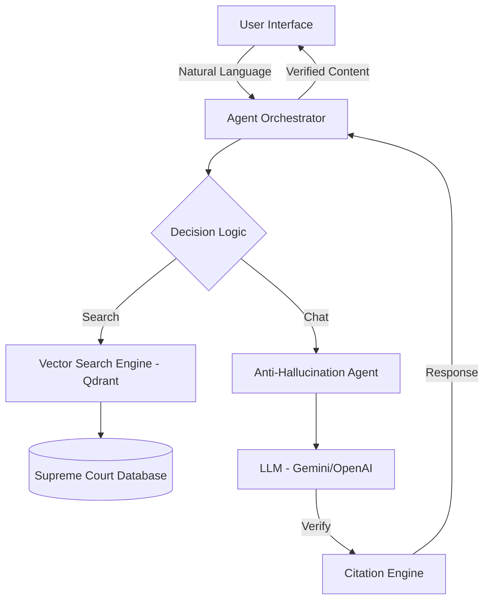

# ⚖️ Smart LegalGuard AI 
> **"Elevating Justice through Intelligent Technology"**
> *รางวัลชนะเลิศนวัตกรรมกระบวนการยุติธรรมดิจิทัล (Showcase Edition)*

---

## 🎯 วิสัยทัศน์ (Project Vision)
ลดช่องว่างความเหลื่อมล้ำในการเข้าถึงกฎหมายไทย ด้วยเทคโนโลยี **Generative AI** ที่มีความรับผิดชอบ (Responsible AI) โดยการเปลี่ยนตัวบทกฎหมายที่ซับซ้อนให้กลายเป็น "ข้อมูลที่เข้าถึงได้และน่าเชื่อถือ" สำหรับทุกคน

## 🚨 ปัญหาที่เราแก้ (The Pain Points)
1. **Legal Complexity**: ประชาชนทั่วไปเข้าใจภาษากฎหมายได้ยาก
2. **Data Overload**: คำพิพากษาและระเบียบมีจำนวนมหาศาล ค้นหาได้ลำบาก
3. **AI Hallucination**: ความเสี่ยงจากการที่ AI ทั่วไปให้ข้อมูลกฎหมายที่ "ผิดเพี้ยน" หรือ "ไม่มีอยู่จริง"

---

## 💡 นวัตกรรมและจุดเด่น (Key Innovations)

### 1. 🤖 ระบบ Anti-Hallucination 7 ชั้น
เราไม่ได้ใช้แค่แชตบอททั่วไป แต่เราสร้าง **Guardrails** 7 ชั้น เพื่อให้มั่นใจว่า "น้องซื่อสัตย์ AI" จะตอบข้อมูลที่มีอ้างอิงจากประมวลกฎหมายจริงเท่านั้น หากไม่มีข้อมูล ระบบจะปฏิเสธการตอบทันทีเพื่อความปลอดภัย

### 2. 🏛️ Luxury Judicial Interface
การออกแบบที่เน้นความน่าเชื่อถือ (Trust-centric Design) โดยใช้โทนสี **Navy, Gold, และ Teal** ซึ่งเป็นสีมาตรฐานสากลของสถาบันยุติธรรม พร้อม Micro-interactions ที่ลื่นไหล ให้ความรู้สึกถึงความเป็นมืออาชีพระดับพรีเมียม

### 3. 🔍 Semantic Context Search (RAG)
การสืบค้นที่ไม่ใช่แค่การจับคู่คำ (Keyword Match) แต่เป็นการค้นหาจาก "ความหมาย" ของข้อเท็จจริง โดยใช้เทคโนโลยี **Vector Embeddings** ร่วมกับฐานข้อมูลคำพิพากษาศาลฎีกา

---

## 🏗️ โครงสร้างสถาปัตยกรรม (System Architecture)

---

## 🛠 Tech Stack & Tools
*   **Frontend**: React + Vite + Framer Motion (State-of-the-art UI)
*   **Vector DB**: Qdrant (High-performance search)
*   **Security**: Role-based Access Control (RBAC) & Data Encryption
*   **Deployment**: CI/CD via GitHub Actions (GitHub Pages)

---

## 📈 ผลกระทบ (Expected Impact)
*   **สำหรับประชาชน**: ลดเวลาและค่าใช้จ่ายในการปรึกษากฎหมายเบื้องต้นได้กว่า 80%
*   **สำหรับเจ้าหน้าที่**: เพิ่มความเร็วในการสืบค้นบรรทัดฐานคดีได้ 10 เท่า
*   **สำหรับสังคม**: เสริมสร้างความเชื่อมั่นในกระบวนการยุติธรรมดิจิทัล (Digital Trust)

---

## 📺 Demo & Showcase
*   **Live Demo**: [https://Phakamas1715.github.io/legalguard-ai/](https://Phakamas1715.github.io/legalguard-ai/)
*   **Video Pitch**: [Coming Soon]

---
© 2026 Smart LegalGuard AI | พัฒนาเพื่อการแข่งขันนวัตกรรมยุติธรรมไทย
